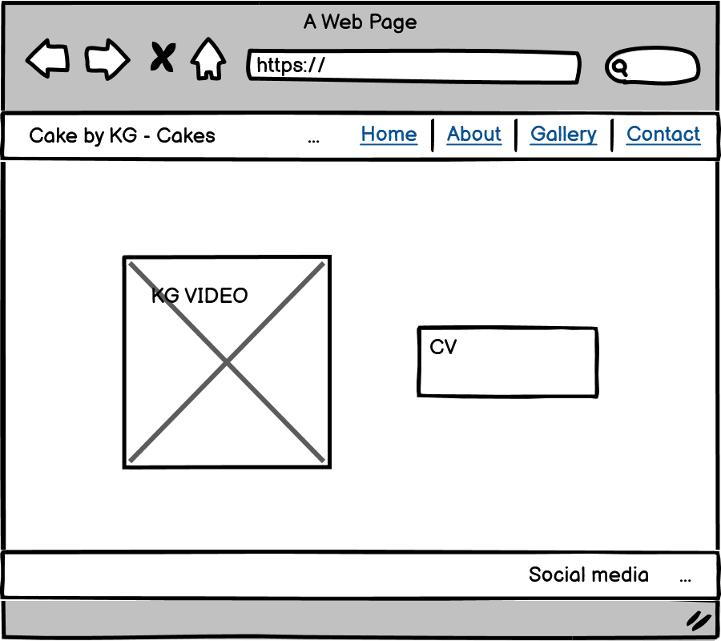
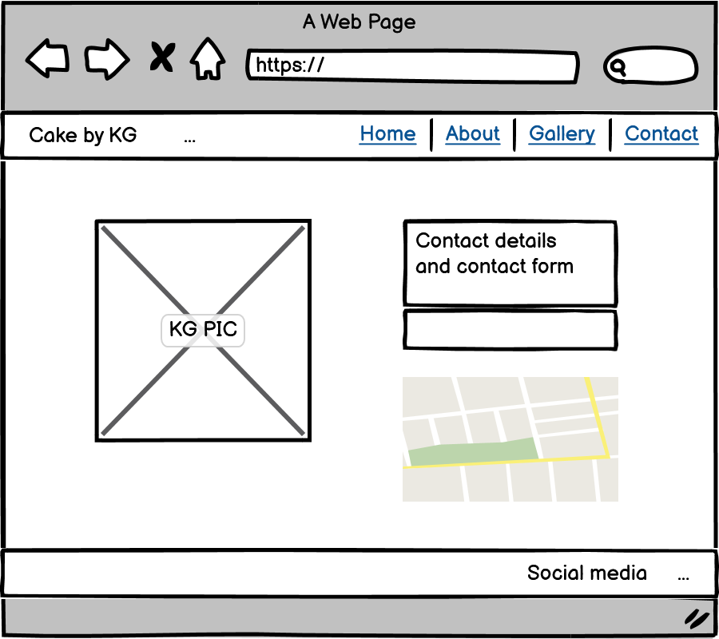

# [CAKES BY KG](https://efthymiakakoulidou.github.io/cakes-by-kg)

Cakes by KG is a website aiming to provide information about the services Katerina Glykou offers which are designing and baking cakes. Apart from the information, the project hopes to inspire the user in the process of chosing a cake. The target audience is people in the Stockholm region who need to order cakes. With the use of picture and contact information the target audience will be able to be inspired chose a cake and order it.

## UX

My aim was to create an accessible and easy-to-navigate website. I wanted it to be welcoming the user to enter a fun and sweet world.

### Colour Scheme

The choice of colours was based on we typically associate to sweet flavors. I chose pink for sugar, beige for cream, brown for chocolate and white. I also chose a lightcyan color inspired by the colour of the cake used as background image.

- saddlebrown used for primary text.
- lightpink used for background to several parts.
- bisque used for the logo.
- bisque used for background to the pages that there is not a background image.

I used [coolors.co](https://coolors.co/palette/ffb6c1-ffe4c4-8b4513-e0ffff-ffffff) to generate my colour palette.

### Typography

I used 2 font-families for my project. One clean and redable for the whole site and one more graphic to create just the logo and titles (as an official logo does not exist yet.)

- [Shadows into light](https://fonts.google.com/specimen/Shadows+Into+Light?query=shadow+) was used for the primary headers and titles.

- [Mako](https://fonts.google.com/specimen/Mako) was used for all other secondary text.

- [Font Awesome](https://fontawesome.com) icons were used throughout the site, such as the social media icons in the footer.

## User Stories

As a user of this site I would like to be able to get inspired and order my cake. 

### New Site Users

- As a new site user, I would like to see pictures of cake, so that I can decide what I want.
- As a new site user, I would like to to have the option to describe my cake of choice, so that I can order a customized cake that will be exactly how I wanted it to be.
- As a new site user, I would like to like to be provided with contact information, so that I can make my order.

### Returning Site Users

- As a returning site user, I would like to see if the site has been updated, so that I can get more cake ideas.
- As a returning site user, I would like to be able to access the contact information, so that I can order again.

## Wireframes

First Header  | Second Header
------------- | -------------
Content Cell  | Content Cell
Content Cell  | Content Cell 

**IMPORTANT**! **IMPORTANT**! **IMPORTANT**!
The example below uses the `details` and `summary` code elements.
However, for these scripts to work, I've had to add spaces within the `< >` elements.

You MUST remove these spaces for it to work properly on your own README/TESTING files.
Remove the spaces within the `< >` brackets for the `details` and `summary` code elements,
for the Mobile, Tablet, and Desktop wireframes.

🛑🛑🛑🛑🛑 END OF NOTES (to be deleted) 🛑🛑🛑🛑🛑

To follow best practice, wireframes were developed for mobile, tablet, and desktop sizes.
I've used [Balsamiq](https://balsamiq.com/wireframes) to design my site wireframes.

### Mobile Wireframes

 Click here to see the Mobile Wireframes 

Home
  - 

About
  - 

Contact
  - 

Gallery
  - 

### Tablet Wireframes

 Click here to see the Tablet Wireframes 

Home
  - 

About
  - 

Contact
  - 

Gallery
  - 

etc.
  - repeat for any remaining tablet wireframes

### Desktop Wireframes

 Click here to see the Desktop Wireframes 

Home
  - 

About
  - 

Contact
  - 

Gallery
  - 

etc.
  - repeat for any remaining desktop wireframes

## Features

The project consists of 7 different pages:
The Home page : This is the first page that the user is going to meet. It welcomes the user and sets the tone for the experience he/she is going to have.
The About page : This page introduces the owner of the page so that the user gets information about the service-provider.
The Contact page : This page provides the contact details of the owner so that the user can easily get in touch with her.
The Gallery page : This page displays the work of the owner to show to user what kind of services they can expect. In here there are 3 categories from which the user can be directed to more specific areas of interest.
The birthday cakes page
The Speciallty cakes
The Sweet treats page

### Existing Features

- The logo button :

    - The logo button is the expression of the whole graphic language of the site in the header. It has the owners initials on it and directs the user to the about page to learn more about the owner.

- The welcome link

    - This feature takes up the center and most important part of the page. It directs the user to the Gallery page which is the page of interest.

- The about link

    - This feature placed a little off center directs the user to the about page. It is essentially the logo button. In smaller screens the logo button disappears but the about-link stays so that we won't miss any information.

- The navigation bar with the dropdown menu

    - This feature is essential to the user. It is used to navigate the user to the diffrent pages of the site directly from the home page.

- The video feature

    - This feature is used to keep the interest of the user on the about page.

- The contact form

    - This feature is used to give to the user the opportunity to contact the owner directly from the site without having to leave the page.

- The google maps i frame

    - This feature is used to show the location of the owner on the map since an address on its own may not provide the same amount of information to all the users.

- The birthday cakes/speciallty cakes/sweet treats galleries

    - There are all of the images here. The user can click on the preview image of each cake and see it enlarged so they can study the details. Also more pictures of the same cake -hidden behind the preview picture - are provided for more information.

### Future Features

In the future and with the scenario that business goes well for the owner it would br helpful to add 

- Prices for the cakes
- billing feautures
    - this will give the user the opportunity to pay for the cake online.
- Make your own cake feature
    - a feature that the user will be able to use his/hers imagination to constract a new cake and then get feedback from the owner. A menu of diffrent flavors will be provided.

## Tools & Technologies Used

- [HTML](https://en.wikipedia.org/wiki/HTML) used for the main site content.
- [CSS](https://en.wikipedia.org/wiki/CSS) used for the main site design and layout.
- [CSS Flexbox](https://www.w3schools.com/css/css3_flexbox.asp) used for an enhanced responsive layout.
- [JavaScript](https://www.javascript.com) used for user interaction on the site.
- [Python](https://www.python.org) used as the back-end programming language.
- [Git](https://git-scm.com) used for version control. (`git add`, `git commit`, `git push`)
- [GitHub](https://github.com) used for secure online code storage.
- [GitHub Pages](https://pages.github.com) used for hosting the deployed front-end site.
- [Gitpod](https://gitpod.io) used as a cloud-based IDE for development.

## Testing

For all testing, please refer to the [TESTING.md](TESTING.md) file.

## Deployment

The site was deployed to GitHub Pages. The steps to deploy are as follows:

- In the [GitHub repository](https://github.com/EfthymiaKakoulidou/cakes-by-kg), navigate to the Settings tab 
- From the source section drop-down menu, select the **Main** Branch, then click "Save".
- The page will be automatically refreshed with a detailed ribbon display to indicate the successful deployment.

The live link can be found [here](https://efthymiakakoulidou.github.io/cakes-by-kg)

### Local Deployment

This project can be cloned or forked in order to make a local copy on your own system.

#### Cloning

You can clone the repository by following these steps:

1. Go to the [GitHub repository](https://github.com/EfthymiaKakoulidou/cakes-by-kg) 
2. Locate the Code button above the list of files and click it 
3. Select if you prefer to clone using HTTPS, SSH, or GitHub CLI and click the copy button to copy the URL to your clipboard
4. Open Git Bash or Terminal
5. Change the current working directory to the one where you want the cloned directory
6. In your IDE Terminal, type the following command to clone my repository:
	- `git clone https://github.com/EfthymiaKakoulidou/cakes-by-kg.git`
7. Press Enter to create your local clone.

Alternatively, if using Gitpod, you can click below to create your own workspace using this repository.

Please note that in order to directly open the project in Gitpod, you need to have the browser extension installed.
A tutorial on how to do that can be found [here](https://www.gitpod.io/docs/configure/user-settings/browser-extension).

#### Forking

By forking the GitHub Repository, we make a copy of the original repository on our GitHub account to view and/or make changes without affecting the original owner's repository.
You can fork this repository by using the following steps:

1. Log in to GitHub and locate the [GitHub Repository](https://github.com/EfthymiaKakoulidou/cakes-by-kg)
2. At the top of the Repository (not top of page) just above the "Settings" Button on the menu, locate the "Fork" Button.
3. Once clicked, you should now have a copy of the original repository in your own GitHub account!

### Local VS Deployment

⚠️⚠️⚠️⚠️⚠️ START OF NOTES (to be deleted) ⚠️⚠️⚠️⚠️⚠️

Use this space to discuss any differences between the local version you've developed, and the live deployment site on GitHub Pages.

🛑🛑🛑🛑🛑 END OF NOTES (to be deleted) 🛑🛑🛑🛑🛑

## Credits

I got all the content of the site from the owners instagram : https://www.instagram.com/cakebykg/

I got help for troubleshooting my problems from :
https://stackoverflow.com/
https://www.w3schools.com/

I got help to build my gallery from :
http://fancybox.net/

I used :
https://fontawesome.com/  for the icons

I used : 
https://fonts.google.com/ for the fonts

I used :
https://www.google.com in general for every little question that I need a quick answer for.

### Content

### Media

### Acknowledgements

- I would like to thank my Code Institute mentor, [Tim Nelson](https://github.com/TravelTimN) for their support throughout the development of this project.
- I would like to thank the [Code Institute](https://codeinstitute.net) tutor team for their assistance with troubleshooting and debugging some project issues.
- I would like to thank the [Code Institute Slack community](https://code-institute-room.slack.com) for the moral support; it kept me going during periods of self doubt and imposter syndrome.
